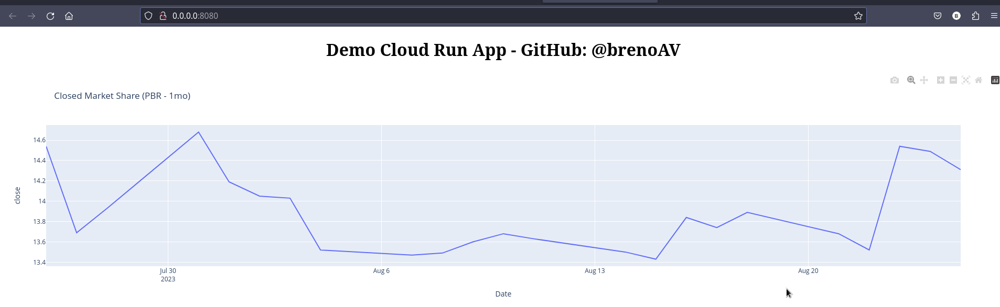
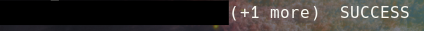
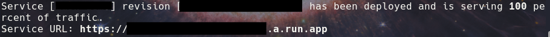

# Dash Cloud Run (Demo)

A demo using Dash (Plotly) for creating the Dashboard and Google Cloud Run for deployment.

- [Dash Cloud Run (Demo)](#dash-cloud-run-demo)
- [Locally Version (optional)](#locally-version-optional)
- [Locally Containerized Version (optional)](#locally-containerized-version-optional)
- [Google Cloud Run](#google-cloud-run)


# Locally Version (optional)

- Create a new environment using your prefer environment manager and activate it:
 
```bash
$ python3 -m venv .venv
$ source .venv/bin/activate  # unix
```

- Install the dependencies:

```bash
$ pip install -r requeriments.txt
```

- You can run the `app.py` and see the dashboard (Don't forget to change to `debug=True` inside the file: [app.py](app.py))

# Locally Containerized Version (optional)

- Be sure that you have [Docker](https://www.docker.com/get-started/) or [Podman](https://podman.io/docs) installed or something similar that works with containers. I used Podman and basically the docker's commands below just need to be changed to "podman" and it works.

- You need to log in into [Docker Hub](https://hub.docker.com/) (Docker Hub) using the command `$ docker login docker.io`. I'm using a small debian-python set up (Python Slim). You can check more information about the image on the [Dockerfile](./Dockerfile)

- Build a Docker images using the command:

```
$ docker build -t dash:latest .
```

- Run the image inside a container with the command:

```bash
$ docker run --network host dash:latest
```

Now, you can copy the URL and open in your browser.



# Google Cloud Run

- If you want to deploy your dashboard in the [Google Cloud Run](https://cloud.google.com/run/docs/overview/what-is-cloud-run) you need first create a `New Project` using [Console of the Google Cloud Plataform](https://console.cloud.google.com/) and enable [Cloud Run API](https://console.cloud.google.com/apis/dashboard)

- Install the [Google Cloud CLI](https://cloud.google.com/cli) (SDK) on your machine. Here is a tutorial that has step-by-step for each OS: [Install the Google Cloud CLI](https://cloud.google.com/sdk/docs/install-sdk).

- Build the Dockerfile in GCR where `<project-id>` you can find on google cloud console and `<application-name-tag>` you decide the name tag.

- **NOTE:** YOU DON'T NEED TO HAVE DOCKER/PODMAN INSTALLED FOR BUILDING IN GOOGLE CONTAINER REGISTRY

```bash
$ gcloud builds submit --tag gcr.io/<project-id>/<application-name-tag> --project=<project-id>
```

- When you finished will be appeared a `SUCCESS` message on the end.



- In the end, you need to deploy for show in the Google Cloud Run:

```bash
gcloud run deploy --image gcr.io/<project_id>/<application-name-tag> --platform managed --project=<project_id> --allow-unauthenticated
```

- Now, you can open the generated URL inside the `Cloud Run` and open your application hosted in Google Cloud.



---
<div align="center">
  <strong>"People’s dreams... Have no ends" - OP</strong>
</div>
<p align="center">
  <sub>Created by BrenoAV</sub>
</p>
